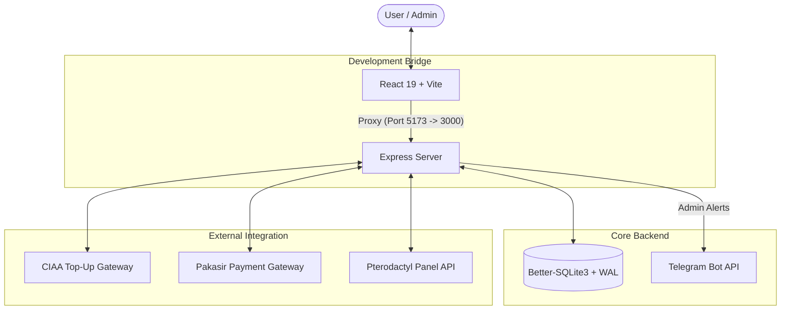

# WANZZ PPOB PLATFORM
### *Enterprise-Grade Digital Product & Payment Gateway Solution*

> [!CAUTION]
> **ARCHITECTURAL DISCLAIMER**: This codebase is currently a "Spaghetti Code" monolithic prototype. It was built for speed and functionality over architectural elegance. You will encounter tight coupling, non-standard project organization, and a "Just Make It Work" philosophy. Proceed with full awareness and handle with care!

---

## 📖 Table of Contents
1.  [Overview](#-overview)
2.  [Exhaustive Tech Stack](#-exhaustive-tech-stack)
3.  [System Architecture](#-system-architecture)
4.  [Core Technical Implementation](#-core-technical-implementation)
5.  [Detailed API Reference](#-detailed-api-reference)
6.  [Environment Configuration](#-environment-configuration)
7.  [Installation & Deployment Guides](#-installation--deployment-guides)
8.  [Project Anatomy](#-project-anatomy)
9.  [Security Standards](#-security-standards)

---

## 🌟 Overview
**Wanzz PPOB Platform** is a powerful digital business engine designed to bridge the gap between users and H2H (Host-to-Host) providers. It automates the entire lifecycle of a digital transaction—from payment collection via Pakasir to product fulfillment through CIAA Top-Up.

### Key Capabilities
- **Automated PPOB**: Real-time product fetching and purchasing.
- **Dual-Gateway Engine**: Separate logic for Top-Up and Payment processing.
- **Pterodactyl Panel Hosting**: Purchase and auto-provision Pterodactyl game panels directly from the web.
- **Admin Command Center**: Complete control over users, transactions, and system settings.
- **Smart Notifications**: Instant alerts via Telegram for high-value events.

---

## 🛠 Exhaustive Tech Stack

### Frontend (Reactive Interface)
- **React 19**: Utilizing the latest concurrent rendering features and hooks.
- **Vite 5**: Blazing fast ESM-based build tool and development server.
- **Tailwind CSS Polyfills**: Modern styling hooks with a focus on responsiveness.
- **Lucide & FontAwesome**: High-fidelity iconography.

### Backend (Secure Engine)
- **Node.js (LTS)**: High-performance runtime for asynchronous I/O.
- **Express.js**: Lightweight framework for RESTful API routing.
- **JWT (jsonwebtoken)**: Stateless session management for users and admins.
- **Bcryptjs**: Industrial-strength password salting and hashing.

### Data Layer (High Availability)
- **Better-SQLite3**: The fastest SQLite driver for Node.js.
- **WAL Mode (Write-Ahead Logging)**: Enabled by default to handle concurrent reads/writes without locking the database.
- **Atomic Transactions**: Integrated `runInTransaction` helper to ensure financial balance integrity.

---

## 🏗 System Architecture

The platform operates as a monolithic system with a decoupled API layer. During development, a Vite proxy bridges the frontend and backend.



---

## 🔐 Core Technical Implementation

### 1. Atomic Balance Logic
Every transaction follows a strict sequence to prevent balance leakage:
1.  **Price Check**: Fetches current H2H price to prevent stale caching exploitation.
2.  **Atomic Deduction**: Deducts user balance within a SQLite transaction.
3.  **Vendor Call**: Executes the H2H purchase.
4.  **Auto-Refund**: If the vendor returns a failure, the balance is restored atomically in a secondary transaction.

### 2. Maintenance Enforcement
A global `maintenance_mode` flag in the `settings` table. When enabled, a specialized middleware intercepts all `/api/` requests (except admin and specific callbacks) and returns a `503 Service Unavailable` with a user-friendly message.

### 3. Real-time API Proxy
Configured in `vite.config.ts`, the proxy allows the frontend to use relative paths like `/api/transaction` which are transparently routed to `localhost:3000` during development, avoiding CORS issues and port conflicts.

---

## 📡 Detailed API Reference

| Category | Endpoint | Method | Purpose |
| :--- | :--- | :--- | :--- |
| **Auth** | `/api/auth/login` | POST | authenticate user/admin & return JWT. |
| | `/api/auth/register` | POST | Create new user account. |
| | `/api/auth/me` | GET | Validates token and returns user profile. |
| **PPOB** | `/api/transaction/products` | GET | Fetch live product list from CIAA API. |
| | `/api/transaction/create` | POST | Initiates a balance-checked purchase. |
| **Deposit** | `/api/deposit/create` | POST | Creates a payment invoice via Pakasir. |
| | `/api/deposit/sync` | GET | Forces a status update call to the gateway. |
| **Pterodactyl** | `/api/pterodactyl/packages` | GET | List all available panel hosting packages. |
| | `/api/pterodactyl/purchase` | POST | Purchase a panel (deducts balance, creates user+server). |
| | `/api/pterodactyl/my-panels` | GET | Get all panels owned by the authenticated user. |
| | `/api/pterodactyl/panel/:id` | GET | Get detail of a specific panel. |
| **Admin** | `/api/admin/users` | GET | List and modify user data. |
| | `/api/admin/settings` | POST | Toggle Maintenance Mode or Profit Margins. |

---

---

## ⚙️ Environment Configuration

Before running the application, you **must** create a `.env` file in the root directory. This file is mandatory and contains sensitive credentials.

> [!IMPORTANT]
> Never share your `.env` file or commit it to version control. Use `.env.example` as a template.

### Gateway Credentials
- `CIAA_API_KEY`: Your API Key from CIAA Top-Up provider.
- `PAKASIR_API_KEY`: Your API Key from Pakasir Payment Gateway.
- `PAKASIR_SLUG`: Your unique business slug from Pakasir.

### System Settings
- `PORT`: The port where the backend server will run (default: `3000`).
- `JWT_SECRET`: A long, random string used to sign authentication tokens. **Change this in production!**

### Telegram Integration (Admin Alerts)
- `TELEGRAM_BOT_TOKEN`: The token from @BotFather for your alert bot.
- `ADMIN_CHAT_ID`: Your personal Telegram Chat ID to receive system notifications.

### Pterodactyl Panel Integration
- `PTERO_DOMAIN`: The URL of your Pterodactyl panel (e.g., `https://panel.example.com`).
- `PTERO_PLTA_API_KEY`: Application API key from Pterodactyl (starts with `ptla_`). Used for creating users and servers.
- `PTERO_PLTC_API_KEY`: Client API key from Pterodactyl (starts with `ptlc_`). Reserved for future client-level operations.
- `PTERO_EGG_ID`: The Egg ID to use for server creation (default: `5`).
- `PTERO_LOCATION_ID`: The Location ID for server deployment (default: `1`).
- `PTERO_DOCKER_IMAGE`: Docker image for server containers (default: `ghcr.io/parkervcp/yolks:nodejs_18`).

### Default Admin Setup
These credentials are used to create the initial admin account when the database is first initialized:
- `ADMIN_EMAIL`: The default email address for the admin login.
- `ADMIN_PASSWORD`: The initial password for the admin account.

---

## 🚀 Installation & Deployment Guides

Choose the scenario that matches your needs. Each guide is self-contained and starts from the absolute beginning.

---

### 🟢 Scenario 1: Local Development (No-Conflict Mode)
**Best for**: Making code changes, testing UI, and debugging logic locally.

1.  **Clone the Project**:
    ```bash
    git clone https://github.com/nashki-labs/wanzz-ppob-platform.git
    cd wanzz-ppob-platform
    ```
2.  **Environment Preparation**:
    - Copy the example file: `cp .env.example .env`
    - Open `.env` and fill in your keys (CIAA, Pakasir, WhatsApp, etc.).
    - Ensure `PORT=3000` is set (this is for the backend).
3.  **Install Dependencies**:
    ```bash
    npm install
    ```
4.  **Launch the Backend Engine**:
    - Open your terminal and run:
      ```bash
      node server.js
      ```
    - The server will start and listen on **http://localhost:3000**.
5.  **Launch the Frontend (Vite)**:
    - Open a **SEPARATE** terminal window.
    - Run:
      ```bash
      npm run dev
      ```
    - The frontend will start on **http://localhost:5173**.
6.  **Access the Application**:
    - Open your browser to **http://localhost:5173**.
    - The Vite proxy in `vite.config.ts` will automatically route all `/api` calls to your Backend on port 3000.

---

### 🔵 Scenario 2: Manual VPS Deployment (Docker Compose)
**Best for**: Setting up the app directly on a Linux server without local automation scripts.

1.  **Access your VPS**:
    - SSH into your server: `ssh root@your-vps-ip`
2.  **Clone the Project on the VPS**:
    ```bash
    git clone https://github.com/nashki-labs/wanzz-ppob-platform.git
    cd wanzz-ppob-platform
    ```
3.  **Configure Environment**:
    - Create the production env file: `nano .env`
    - Paste your production credentials and save (Ctrl+O, Enter, Ctrl+X).
    - *Note: Ensure your `JWT_SECRET` is strong and unique.*
4.  **Prepare Docker**:
    - Ensure Docker and Docker Compose are installed on your VPS.
5.  **Build and Start Containers**:
    ```bash
    docker compose up -d --build
    ```
    - This command will:
        - Build the production image.
        - Install dependencies inside the container.
        - Map port **3000** of the container to port **3000** of your VPS.
        - Mount a volume for your database data in `./data` to ensure persistence.
6.  **Verify Status**:
    - Run `docker compose ps` to ensure the service is `Up (healthy)`.
    - Access via **http://your-vps-ip:3000**.

---

### 🟡 Scenario 3: Automated Deployment (`deploy.sh`)
**Best for**: Working on your local machine and pushing updates to a VPS with one command.

1.  **Prepare Locally**:
    - Clone the project to your computer:
      ```bash
      git clone https://github.com/nashki-labs/wanzz-ppob-platform.git
      cd wanzz-ppob-platform
      ```
2.  **Local Configuration**:
    - Create a `.env` file locally: `cp .env.example .env`
    - Fill it with the **Production** keys (since this file will be synced to the server).
3.  **Grant Execution Permissions**:
    ```bash
    chmod +x deploy.sh
    ```
4.  **Execute Deployment**:
    - Run the script with your VPS IP:
      ```bash
      ./deploy.sh <YOUR_VPS_IP>
      ```
    - **How it works**:
        - It creates the `wanzz-ppob-platform` directory on your VPS.
        - It uses `rsync` to sync your local files (including `.env`) while ignoring `node_modules` and `.git`.
        - It triggers `docker compose up -d --build` on the remote server.
5.  **Accessing the Live App**:
    - Once finished, visit **http://your-vps-ip:3000**.

---

**Developed with AI and Focus on Functionality**  
*The Wanzz PPOB Platform team*
